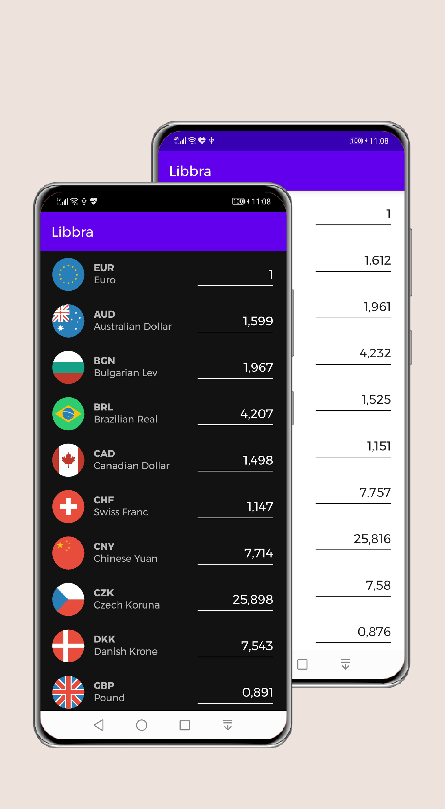
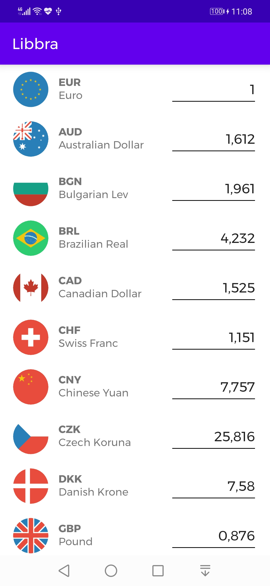
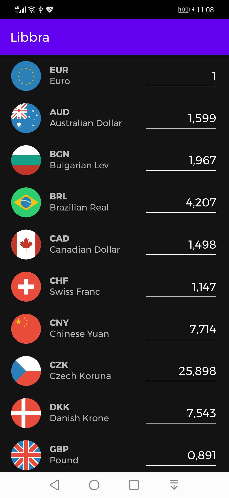

## Libbra

[](https://ktlint.github.io/)
[](http://kotlinlang.org/)
[](https://lv.binarybabel.org/catalog/gradle/latest)
[](https://android-arsenal.com/api?level=21)
[](http://www.apache.org/licenses/LICENSE-2.0)

<p align="center"></p>

Libbra is a sample app that allows to track currency exchanges. This app presents modern approach to [Android](https://www.android.com/) application development using [Kotlin](https://kotlinlang.org/) and latest tech-stack.

This project is a hiring task by [Revolut](https://www.revolut.com/). The goal of the project is to demonstrate best practices, provide a set of guidelines, and present modern Android
application architecture that is modular, scalable, maintainable and testable. This application may look simple, but it
has all of these small details that will set the rock-solid foundation of the larger app suitable for bigger teams and
long application lifecycle management.

## Table of Contents

-   [Development](https://github.com/nuhkoca/revolut-task-libbra#development)
-   [Design](https://github.com/nuhkoca/revolut-task-libbra#design)
-   [Architecture](https://github.com/nuhkoca/revolut-task-libbra#architecture)
-   [Tech-stack](https://github.com/nuhkoca/revolut-task-libbra#tech-stack)
-   [Author](https://github.com/nuhkoca/revolut-task-libbra#authors)
-   [License](https://github.com/nuhkoca/revolut-task-libbra#license)

## Development

### Environment setup

First off, you require the latest Android Studio 3.6.0 (or newer) to be able to build the app.

Moreover, to sign your app for release, please refer to `keystore.properties` to find required fields.

```properties
#Signing Config
signing.store.password=<look>
signing.key.password=<look>
signing.key.alias=<look>
signing.store.file=<look>
```

### Code style

To maintain the style and quality of the code, are used the bellow static analysis tools. All of them use properly configuration and you find them in the project root directory `.{toolName}`.

| Tools                                                   | Config file                                                                       | Check command             | Fix command               |
|---------------------------------------------------------|----------------------------------------------------------------------------------:|---------------------------|---------------------------|
| [detekt](https://github.com/arturbosch/detekt)          | [/.detekt](https://github.com/nuhkoca/revolut-task-libbra/tree/master/default-detekt-config.yml)     | `./gradlew detekt`        | -                         |
| [ktlint](https://github.com/JLLeitschuh/ktlint-gradle)  | -                                                                                 | `./gradlew ktlintCheck`   | `./gradlew ktlintFormat`  |
| [spotless](https://github.com/diffplug/spotless)        | [/.spotless](https://github.com/nuhkoca/revolut-task-libbra/tree/master/spotless) | `./gradlew spotlessCheck` | `./gradlew spotlessApply` |
| [lint](https://developer.android.com/studio/write/lint) | [/.lint](https://github.com/nuhkoca/revolut-task-libbra/tree/master/.lint)        | `./gradlew lint`          | -                         |

All these tools are integrated in [pre-commit git hook](https://git-scm.com/book/en/v2/Customizing-Git-Git-Hooks), in order
ensure that all static analysis and tests passes before you can commit your changes. To skip them for specific commit add this option at your git command:

```shell
git commit --no-verify
```

The pre-commit git hooks have exactly the same checks as [Github Actions](https://github.com/actions) and are defined in this [script](https://github.com/nuhkoca/revolut-task-libbra/blob/master/scripts/git-hooks/pre-commit.sh). This step ensures that all commits comply with the established rules. However the continuous integration will ultimately be validated that the changes are correct.

## Design

App [support different screen sizes](https://developer.android.com/training/multiscreen/screensizes) and the content has been adapted to fit for mobile devices and tablets. To do that, it has been created a flexible layout using one or more of the following concepts:

-   [Use constraintLayout](https://developer.android.com/training/multiscreen/screensizes#ConstraintLayout)
-   [Avoid hard-coded layout sizes](https://developer.android.com/training/multiscreen/screensizes#TaskUseWrapMatchPar)
-   [Create alternative layouts](https://developer.android.com/training/multiscreen/screensizes#alternative-layouts)
-   [Use the smallest width qualifier](https://developer.android.com/training/multiscreen/screensizes#TaskUseSWQuali)
-   [Use the available width qualifier](https://developer.android.com/training/multiscreen/screensizes#available-width)
-   [Add orientation qualifiers](https://developer.android.com/training/multiscreen/screensizes#TaskUseOriQuali)

In terms of design has been followed recommendations [android material design](https://developer.android.com/guide/topics/ui/look-and-feel) comprehensive guide for visual, motion, and interaction design across platforms and devices. Granting the project in this way a great user experience (UX) and user interface (UI). For more info about UX best practices visit [link](https://developer.android.com/topic/google-play-instant/best-practices/apps).

Moreover, has been implemented support for [dark theme](https://developer.android.com/guide/topics/ui/look-and-feel/darktheme) with the following benefits:
-   Can reduce power usage by a significant amount (depending on the device’s screen technology).
-   Improves visibility for users with low vision and those who are sensitive to bright light.
-   Makes it easier for anyone to use a device in a low-light environment.

| Page  | Light Mode                                        | Dark Mode |
|-------|---------------------------------------------------|------------------------------------------|
| Currency |  | |

## Architecture

The architecture of the application is based, apply and strictly complies with each of the following 5 points:

-   A single-activity architecture, using the [Navigation component](https://developer.android.com/guide/navigation/navigation-getting-started) to manage fragment operations.
-   [Android architecture components](https://developer.android.com/topic/libraries/architecture/), part of Android Jetpack for give to project a robust design, testable and maintainable.
-   Pattern [Model-View-ViewModel](https://en.wikipedia.org/wiki/Model%E2%80%93view%E2%80%93viewmodel) (MVVM) facilitating a [separation](https://en.wikipedia.org/wiki/Separation_of_concerns) of development of the graphical user interface.
-   [S.O.L.I.D](https://en.wikipedia.org/wiki/SOLID) design principles intended to make software designs more understandable, flexible and maintainable.
-   [Modular app architecture](https://proandroiddev.com/build-a-modular-android-app-architecture-25342d99de82) allows to be developed features in isolation, independently from other features.

### Modules

Modules are collection of source files and build settings that allow you to divide a project into discrete units of functionality. In this case apart from dividing by functionality/responsibility, existing the following dependence between them:

The above graph shows the app modularisation:

-   `:app` depends on `:rules`.
-   `:rules` depends on nothing.

#### App module

The `:app` module is an [com.android.application](https://developer.android.com/studio/build/), which is needed to create the app bundle.  It is also responsible for initiating the [dependency graph](https://github.com/google/dagger) and another project global libraries, differentiating especially between different app environments.

#### Rules modules

The `:rules` module is an [com.android.library](https://developer.android.com/studio/projects/android-library), basically contains lint checks for the entire project.

### Architecture components

Ideally, ViewModels shouldn’t know anything about Android. This improves testability, leak safety and modularity. ViewModels have different scopes than activities or fragments. While a ViewModel is alive and running, an activity can be in any of its lifecycle states. Activities and fragments can be destroyed and created again while the ViewModel is unaware.

Passing a reference of the View (activity or fragment) to the ViewModel is a serious risk. Lets assume the ViewModel requests data from the network and the data comes back some time later. At that moment, the View reference might be destroyed or might be an old activity that is no longer visible, generating a memory leak and, possibly, a crash.


The communication between the different layers follow the above diagram using the reactive paradigm, observing changes on components without need of callbacks avoiding leaks and edge cases related with them.

## Tech-stack

This project takes advantage of many popular libraries, plugins and tools of the Android ecosystem. Most of the libraries are in the stable version, unless there is a good reason to use non-stable dependency.

### Dependencies

-   [Jetpack](https://developer.android.com/jetpack):
    -   [Android KTX](https://developer.android.com/kotlin/ktx.html) - provide concise, idiomatic Kotlin to Jetpack and Android platform APIs.
    -   [AndroidX](https://developer.android.com/jetpack/androidx) - major improvement to the original Android [Support Library](https://developer.android.com/topic/libraries/support-library/index), which is no longer maintained.
    -   [Data Binding](https://developer.android.com/topic/libraries/data-binding/) - allows you to bind UI components in your layouts to data sources in your app using a declarative format rather than programmatically.
    -   [ViewBinding](https://developer.android.com/topic/libraries/view-binding) - allows you to more easily write code that interacts with views.
    -   [Lifecycle](https://developer.android.com/topic/libraries/architecture/lifecycle) - perform actions in response to a change in the lifecycle status of another component, such as activities and fragments.
    -   [LiveData](https://developer.android.com/topic/libraries/architecture/livedata) - lifecycle-aware, meaning it respects the lifecycle of other app components, such as activities, fragments, or services.
    -   [Navigation](https://developer.android.com/guide/navigation/) - helps you implement navigation, from simple button clicks to more complex patterns, such as app bars and the navigation drawer.
    -   [ViewModel](https://developer.android.com/topic/libraries/architecture/viewmodel) - designed to store and manage UI-related data in a lifecycle conscious way. The ViewModel class allows data to survive configuration changes such as screen rotations.
-   [Coroutines](https://kotlinlang.org/docs/reference/coroutines-overview.html) - managing background threads with simplified code and reducing needs for callbacks.
-   [Dagger2](https://dagger.dev/) - dependency injector for replacement all FactoryFactory classes.
-   [Retrofit](https://square.github.io/retrofit/) - type-safe HTTP client.
-   [Coil](https://github.com/coil-kt/coil) - image loading library for Android backed by Kotlin Coroutines.
-   [Kotlinx Serialization](https://github.com/Kotlin/kotlinx.serialization) - consists of a compiler plugin, that generates visitor code for serializable classes, runtime library with core serialization API and JSON format, and support libraries with ProtoBuf, CBOR and properties formats.
-   [Timber](https://github.com/JakeWharton/timber) - a logger with a small, extensible API which provides utility on top of Android's normal Log class.
-   [and more...](https://github.com/nuhkoca/revolut-task-libbra/blob/master/buildSrc/src/main/kotlin/dependencies/Dependencies.kt)

### Test dependencies

-   [Orchestrator](https://developer.android.com/training/testing/junit-runner#using-android-test-orchestrator) - allows you to run each of your app's tests within its own invocation of Instrumentation.
-   [Espresso](https://developer.android.com/training/testing/espresso) - to write concise, beautiful, and reliable Android UI tests
-   [JUnit](https://github.com/junit-team/junit4) - a simple framework to write repeatable tests. It is an instance of the xUnit architecture for unit testing frameworks.
-   [JUnit5](https://github.com/mannodermaus/android-junit5) - a Gradle plugin that allows for the execution of JUnit 5 tests in Android environments using Android Gradle Plugin 3.5.0 or later.
-   [Mockk](https://github.com/mockk/mockk) - provides DSL to mock behavior. Built from zero to fit Kotlin language.
-   [AndroidX](https://github.com/android/android-test) - the androidx test library provides an extensive framework for testing Android apps.
-   [and more...](https://github.com/nuhkoca/revolut-task-libbra/blob/master/buildSrc/src/main/kotlin/dependencies/Dependencies.kt)

### Plugins

-   [Ktlint](https://github.com/JLLeitschuh/ktlint-gradle) - a pluging that creates convenient tasks in your Gradle project that run ktlint checks or do code auto format.
-   [Detekt](https://github.com/arturbosch/detekt) - a static code analysis tool for the Kotlin programming language.
-   [Spotless](https://github.com/diffplug/spotless) - a code formatter can do more than just find formatting errors.
-   [Versions](https://github.com/ben-manes/gradle-versions-plugin) - make easy to determine which dependencies have updates.
-   [JUnit5](https://github.com/mannodermaus/android-junit5) - a Gradle plugin that allows for the execution of JUnit5 tests in Android environments using Android Gradle Plugin 3.5.0 or later.
-   [and more...](https://github.com/nuhkoca/revolut-task-libbra/blob/master/buildSrc/src/main/kotlin/plugins/BuildPlugins.kt)

## Authors

<a href="https://twitter.com/_nuhkoca" target="_blank">
  
</a>

**Nuh Koca**

[](https://www.linkedin.com/in/nuhkoca/)
[](https://twitter.com/_nuhkoca)
[](https://medium.com/@nuhkocaa)
[](http://nuhkoca.com/)

## License

* The preview images were created using 'Previewed' at previewed.app
* The currency and application icons were created at iconscout.com

```license
Copyright 2020 Nuh Koca

Licensed under the Apache License, Version 2.0 (the "License");
you may not use this file except in compliance with the License.
You may obtain a copy of the License at

    http://www.apache.org/licenses/LICENSE-2.0

Unless required by applicable law or agreed to in writing, software
distributed under the License is distributed on an "AS IS" BASIS,
WITHOUT WARRANTIES OR CONDITIONS OF ANY KIND, either express or implied.
See the License for the specific language governing permissions and
limitations under the License.
```
